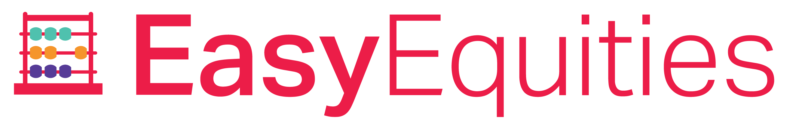

<div id="top"></div>


[![Contributors][contributors-shield]][contributors-url]
[![Forks][forks-shield]][forks-url]
[![Stargazers][stars-shield]][stars-url]
[![Issues][issues-shield]][issues-url]
[![MIT License][license-shield]][license-url]
[![LinkedIn][linkedin-shield]][linkedin-url]


<!-- PROJECT LOGO -->
<br />
<div align="center">
  <a href="https://github.com/Samuel-Sendzul/easy-equities">
    
  </a>

<h3 align="center">EasyEquities.js</h3>

  <p align="center">
    A Node.js package for programatically interacting with Easy Equities. Currently, Easy Equities does not have a documented public API so a combination of scraping and calls to the Easy
    Equities backend needs to be implemented in order to access account data programmatically. This package provides the functionality to do so.
    <br />
    <a href="https://github.com/Samuel-Sendzul/easy-equities"><strong>Explore the docs »</strong></a>
    <br />
    <br />
    <a href="https://github.com/Samuel-Sendzul/easy-equities">View Demo</a>
    ·
    <a href="https://github.com/Samuel-Sendzul/easy-equities/issues">Report Bug</a>
    ·
    <a href="https://github.com/Samuel-Sendzul/easy-equities/issues">Request Feature</a>
  </p>
</div>


<!-- TABLE OF CONTENTS -->
<details>
  <summary>Table of Contents</summary>
  <ol>
    <li>
      <a href="#about-the-project">About The Project</a>
      <ul>
        <li><a href="#built-with">Built With</a></li>
      </ul>
    </li>
    <li>
      <a href="#getting-started">Getting Started</a>
      <ul>
        <li><a href="#prerequisites">Prerequisites</a></li>
        <li><a href="#installation">Installation</a></li>
      </ul>
    </li>
    <li><a href="#usage">Usage</a></li>
    <li><a href="#roadmap">Roadmap</a></li>
    <li><a href="#contributing">Contributing</a></li>
    <li><a href="#license">License</a></li>
    <li><a href="#contact">Contact</a></li>
  </ol>
</details>


<!-- ABOUT THE PROJECT -->
## About The Project

[Easy Equities](https://www.easyequities.co.za/) is a low-cost investment platform available in South Africa. Many beginner and experienced investors use the platform because of its simple interface and low barrier to begin investing. However, Easy Equities has not made a documented API available to the public to access account data programatically. This Node.js implements a combination of web scraping and calls to the Easy Equities backend to enable developers to access their account data programatically.

With this package, you can implement automated balance checking, portfolio tracking, custom notification, backtesting, etc. Eventually many of these features will form part of the package but currently, the functionality exists for you to create these features on your own.

<p align="right">(<a href="#top">back to top</a>)</p>


### Built With

* [Node.js](https://nodejs.org/en/)
* [Axios](https://axios-http.com/docs/intro)
* [Cheerio](https://cheerio.js.org/)
* [JQuery](https://jquery.com)

<p align="right">(<a href="#top">back to top</a>)</p>


<!-- GETTING STARTED -->
## Getting Started

To get a local copy up and running follow these simple example steps.

### Prerequisites

* Node v18.13.0

### Installation

1. Set up an account on [Easy Equities](https://www.easyequities.co.za/) and save your username and password.
2. Clone the repo
   ```sh
   git clone https://github.com/Samuel-Sendzul/easy-equities.git
   ```
3. Install NPM packages
   ```sh
   npm install --legacy-peer-deps
   ```

<p align="right">(<a href="#top">back to top</a>)</p>


<!-- USAGE EXAMPLES -->
## Usage

Here is an example of how to fetch all investment accounts associated with an Easy Equities account:


```javascript
var easyequities = require('easyequities')

async function getMyHoldings(username, password) {
  // Login to EasyEquities. This will store the session token returned from EasyEquities in the auth module
  const token = await easyequities.auth.login(username, password)

  // Query holdings by account ID
  const holdings = await easyequities.accounts.holdings()

  console.log(holdings)

}

getMyHoldings("someUsername", "s3cr3tPassword")

```

<p align="right">(<a href="#top">back to top</a>)</p>


<!-- ROADMAP -->
## Roadmap

- [ ] Make it possible to query accounts by name OR by account ID.
- [ ] Add features to track the historic value of a portfolio. This should be done through wallet snapshots daily.
- [ ] Add a feature to perform a simple backtest on a long-only portfolio strategy.

See the [open issues](https://github.com/Samuel-Sendzul/easy-equities/repo_name/issues) for a full list of proposed features (and known issues).

<p align="right">(<a href="#top">back to top</a>)</p>


<!-- CONTRIBUTING -->
## Contributing

Contributions are what make the open source community such an amazing place to learn, inspire, and create. Any contributions you make are **greatly appreciated**.

If you have a suggestion that would make this better, please fork the repo and create a pull request. You can also simply open an issue with the tag "enhancement".
Don't forget to give the project a star! Thanks again!

1. Fork the Project
2. Create your Feature Branch (`git checkout -b feature/AmazingFeature`)
3. Commit your Changes (`git commit -m 'Add some AmazingFeature'`)
4. Push to the Branch (`git push origin feature/AmazingFeature`)
5. Open a Pull Request

<p align="right">(<a href="#top">back to top</a>)</p>


<!-- LICENSE -->
## License

Distributed under the MIT License. See `LICENSE.txt` for more information.

<p align="right">(<a href="#top">back to top</a>)</p>


<!-- CONTACT -->
## Contact

Samuel Sendzul - [@samuel_sendzul](https://twitter.com/samuel_sendzul) - samuel.sendzul@gmail.com

Project Link: [https://github.com/Samuel-Sendzul/easy-equities](https://github.com/Samuel-Sendzul/easy-equities)

<p align="right">(<a href="#top">back to top</a>)</p>


<!-- MARKDOWN LINKS & IMAGES -->
<!-- https://www.markdownguide.org/basic-syntax/#reference-style-links -->
[contributors-shield]: https://img.shields.io/github/contributors/Samuel-Sendzul/easy-equities.svg?style=for-the-badge
[contributors-url]: https://github.com/Samuel-Sendzul/easy-equities/graphs/contributors
[forks-shield]: https://img.shields.io/github/forks/Samuel-Sendzul/easy-equities.svg?style=for-the-badge
[forks-url]: https://github.com/Samuel-Sendzul/easy-equities/network/members
[stars-shield]: https://img.shields.io/github/stars/Samuel-Sendzul/easy-equities.svg?style=for-the-badge
[stars-url]: https://github.com/Samuel-Sendzul/easy-equities/stargazers
[issues-shield]: https://img.shields.io/github/issues/Samuel-Sendzul/easy-equities.svg?style=for-the-badge
[issues-url]: https://github.com/Samuel-Sendzul/easy-equities/issues
[license-shield]: https://img.shields.io/github/license/Samuel-Sendzul/easy-equities.svg?style=for-the-badge
[license-url]: https://github.com/Samuel-Sendzul/easy-equities/blob/main/LICENSE.txt
[linkedin-shield]: https://img.shields.io/badge/-LinkedIn-black.svg?style=for-the-badge&logo=linkedin&colorB=555
[linkedin-url]: https://linkedin.com/in/samuel-sendzul